# Declaration, Top-Level, and Container AST Hierarchy Refactoring

This document proposes a canonical V2 hierarchy for top-level declarations, member declarations, instance declarations, and instance-declaration bodies, with the existing V1 nodes retained as compatibility projections. It also introduces `FragmentDeclaringNode` as the sound capability for AST nodes that directly contribute exactly one fragment.

The intended result has five independent axes:

- `TopLevelDeclaration` describes a V2 grammar slot;
- `MemberDeclaration` describes the V2 member-declaration grammar slot;
- `InstanceDeclaration` describes the V2 category of top-level declarations that contribute an `InstanceFragment` and expose a normalized body containing their explicitly written members;
- `InstanceDeclarationBody` describes the orthogonal semicolon-versus-block body shape, while `EnumDeclarationBody` adds enum-specific contents; and
- `FragmentDeclaringNode` describes whether a node directly binds one semantic fragment.

The migration is V2-first. Parsing, resolution, serialization, rewriting, and semantic state belong to canonical V2 nodes. Existing unsuffixed V1 nodes delegate to those nodes as cached compatibility projections. A canonical V2 node must not implement a legacy V1 interface merely to avoid creating a projection.

The executable-declaration migration is a later slice, but this document fixes its hierarchy boundary: top-level functions, getters, and setters are distinct canonical V2 declarations, and named declarations do not use a `FunctionExpression` as a reusable declaration suffix. The detailed parser, recovery, and expression migration remains deferred.

Migration model reference: [Compatibility-Preserving AST Refactoring #63685](https://github.com/dart-lang/sdk/issues/63685).

### Document Size Budget

Keep this Markdown source under 64 KiB (65,536 UTF-8 bytes). Check the size with:

```shell
wc -c doc/refactorings/declaration_and_container_hierarchy_refactoring.md
```

Write each prose paragraph as one source line; do not force-wrap prose. Keep structural line breaks in lists, tables, diagrams, and code blocks.

When an edit would exceed the budget, preserve the normative hierarchy, property contracts, invariants, compatibility boundaries, and V1/V2 projection requirements. Trim or consolidate, in order:

1. duplicated rationale already stated in the design principles;
2. repeated examples or visitor chains that demonstrate the same rule;
3. prose that merely restates a nearby type map or interface declaration; and
4. detailed implementation walkthroughs or large recovery matrices, which can move to a linked companion document.

Do not recover space by removing unresolved design decisions, soundness constraints, or V1/V2 projection requirements.

---

## 1. Problems in the Current Hierarchy

### 1.1 `ClassMember` Is Also a `Declaration`

The current hierarchy says:

```text
sealed class ClassMember implements Declaration {}
```

Its direct public implementations are:

- `ConstructorDeclaration`
- `FieldDeclaration`
- `MethodDeclaration`
- `PrimaryConstructorBody`

This is not a sound V2 fragment-declaration hierarchy. `FieldDeclaration` is one source-level member construct that can contain multiple `VariableDeclaration` bindings, so it does not directly contribute one fragment. V2 names that grammar-slot node `FieldDeclarations` and gives each individual binding a `FieldDeclaration2` child with its own `FieldFragment?`. `PrimaryConstructorBody` occupies a member-declaration grammar position, but it is not the node that declares the constructor fragment: that fragment belongs to `PrimaryConstructorDeclaration`.

The legacy relationship forces `FieldDeclaration` and `PrimaryConstructorBody` to inherit `Declaration.declaredFragment` and return `null`. V2 should instead model `MemberDeclaration` as a syntactic grammar slot directly under `AnnotatedNode`, and apply `FragmentDeclaringNode` only to the member declarations that directly contribute fragments.

### 1.2 `MethodDeclaration` Is a Tagged Union

The current `MethodDeclaration` represents four grammar forms: ordinary methods, operators, getters, and setters. Clients distinguish them through `isOperator`, `isGetter`, and `isSetter`, then interpret nullable properties whose valid combinations depend on those booleans. The element builder performs the same dispatch to choose a `MethodFragment`, `GetterFragment`, or `SetterFragment`.

V2 should instead represent the four forms as `MethodDeclaration2`, `OperatorDeclaration`, `GetterDeclaration`, and `SetterDeclaration`. This gives ordinary methods and operators `MethodFragment?`, getters `GetterFragment?`, and setters `SetterFragment?`, while making each form's required syntax non-nullable. Recovery-only syntax is exposed as a public property only when it has a demonstrated V2 consumer; otherwise it remains internal recovery state available to traversal, diagnostics, and V1 projection.

### 1.3 There Is No Common V2 Type for Instance Declarations

Six top-level declaration forms contribute an `InstanceFragment`:

- `ClassDeclaration`
- `ClassTypeAlias`
- `MixinDeclaration`
- `EnumDeclaration`
- `ExtensionDeclaration`
- `ExtensionTypeDeclaration`

Consumers currently enumerate these types or select the overly broad `CompilationUnitMember` ancestor. An exhaustive test is easy to forget when a new declaration kind is added, while `CompilationUnitMember` can also select top-level functions, variables, and non-class type aliases.

Five forms have a `memberedDeclarationBody` or `enumBody` in the grammar. A class type alias instead ends its `mixinApplicationClass` with a semicolon. V2 deliberately normalizes that terminator as a `SemicolonInstanceDeclarationBody`, whose member list is empty, so that every `InstanceDeclaration` has one body-owned view of explicitly written members. The covariant `ClassTypeAlias2.body` type prevents a class type alias from acquiring a block body.

The common type does not imply that every member operation is valid in every container. It is useful for locating instance declarations and inspecting explicitly written members; field creation, constructor creation, and similar operations still require operation-specific language checks.

### 1.4 `CompilationUnitMember` Has the Wrong Grammar-Slot Name and Supertype

The current interface is:

```text
abstract final class CompilationUnitMember implements Declaration {}
```

The language grammar and `CompilationUnit.declarations` describe these nodes as top-level declarations. `TopLevelDeclaration` is therefore the appropriate V2 grammar-slot name. It must not inherit the legacy `Declaration` interface, because that would also inherit its unsound single-fragment capability: some top-level declaration constructs, notably `TopLevelVariableDeclaration`, contain multiple direct bindings.

The old interface cannot be changed in place during the compatibility period. Concrete top-level nodes whose V2 hierarchy changes need canonical `*2` nodes and V1 projections, just like the member family.

### 1.5 `Declaration.declaredFragment` Is Not a Sound Capability

`Declaration` currently combines annotation ownership, source declaration syntax, and fragment binding:

```text
abstract final class Declaration implements AnnotatedNode {
  Fragment? get declaredFragment;
}
```

It has false positives: `FieldDeclaration`, `TopLevelVariableDeclaration`, and `PrimaryConstructorBody` expose a getter that cannot return a fragment for the node itself. It also has false negatives: `CompilationUnit`, `AnonymousMethodInvocation`, `FormalParameter`, `GenericFunctionType`, `DeclaredVariablePattern`, `CatchClauseParameter`, and `Label` directly contribute fragments but do not implement `Declaration`.

The wrapper `PatternVariableDeclaration` does not itself have a `BindPatternVariableFragment`; the direct fragment-bearing node in its pattern is `DeclaredVariablePattern`.

---

## 2. Design Principles

### 2.1 Canonical V2, Projected V1

When a public node's hierarchy or structure differs between views, the node types must differ as well. The canonical V2 node owns children and semantic state; the V1 node is a cached projection that delegates to the V2 origin. One public leaf implementing both incompatible hierarchy interfaces is an additive shim, not a V1-to-V2 migration.

### 2.2 Keep Grammar Slots and Semantic Capabilities Distinct

`MemberDeclaration` and `TopLevelDeclaration` describe the member and top-level declaration grammar categories relevant to this hierarchy. `InstanceDeclaration` is a normalized structural and semantic category, while `FragmentDeclaringNode` describes only the capability to contribute one fragment. A category may implement the capability when every node in that category directly contributes one fragment, as `InstanceDeclaration` does, but wrappers and body-only nodes must not acquire meaningless nullable getters.

The `MemberDeclaration` name follows the language grammar's `memberDeclaration` category. Enum entries remain outside this category, as the grammar stores them separately from the member declarations in an enum body.

### 2.3 Model Direct, Single-Fragment Binding

`FragmentDeclaringNode` means that the node itself contributes exactly one fragment when resolved. It excludes wrappers whose children contribute fragments, nodes that merely refer to another declaration's fragment, and V1 compatibility nodes whose getter returns `null` by construction. The getter remains nullable because unresolved ASTs do not have fragments; the capability makes declaration cardinality precise, not resolution state non-nullable.

### 2.4 Preserve View Isolation

V2 traversal uses V2 nodes, `parent2`, V2 child accessors, and `AstVisitor2`. V1 traversal uses projected nodes, `parent`, legacy child accessors, and `AstVisitor`. A V1 projection must not enter V2 traversal, and a V2-only node must not enter a legacy visitor.

### 2.5 Require a Concrete Consumer Benefit

New hierarchy and properties should support demonstrated consumers. Element-model symmetry is useful evidence, but is not sufficient by itself to introduce another public interface or nullable convenience property.

### 2.6 Normalize Deliberately, Preserve the Distinction

The V2 AST need not reproduce every grammar nonterminal as a public type. `InstanceDeclarationBody` is a deliberate normalization across `memberedDeclarationBody`, `enumBody`, and the terminating semicolon of a class type alias. The normalization must nevertheless preserve all source distinctions: semicolon and block forms have different node types, enum bodies expose constants and their member separator, and `ClassTypeAlias2.body` is statically restricted to the semicolon form.

### 2.7 Own Comments and Metadata Canonically

`AnnotatedNode` is an orthogonal common API for concrete nodes that directly own metadata annotations, an associated documentation comment, or both. It introduces no intermediate AST node: each annotation and comment has the concrete node as its `parent2`. All comment and metadata access, range, traversal, and prefix-token behavior must describe that owned state; a canonical V2 node never forwards it from an ancestor.

The interface lets consumers inspect the complete prefix without enumerating concrete node types. Metadata and documentation may be supported independently, and data applying semantically to multiple fragments is stored once on their common AST owner and propagated only in the element model.

This rule also makes `ForEachPartsWithPattern` and `RecordTypeAnnotationField` implement `AnnotatedNode`. Their `firstTokenAfterCommentAndMetadata` values are respectively the `final` or `var` keyword and the first token of the field type. Their primary visitor chains remain unchanged, and `documentationComment` may remain `null` until supported. The rule does not make every statement an `AnnotatedNode`.

---

## 3. Canonical V2 Architecture

```mermaid
classDiagram
    direction LR
    class AstNode
    class AnnotatedNode {
        <<orthogonal interface>>
        +documentationComment: Comment?
        +metadata: NodeList~Annotation~
        +firstTokenAfterCommentAndMetadata: Token
    }
    class Statement
    class Expression
    class FragmentDeclaringNode {
        <<semantic capability>>
        +declaredFragment: Fragment?
    }
    class MemberDeclaration {
        <<V2 grammar slot>>
    }
    class TopLevelDeclaration {
        <<V2 grammar slot>>
    }
    class InstanceDeclaration {
        <<V2 instance declaration>>
        +body: InstanceDeclarationBody
        +typeParameters: TypeParameterList?
        +declaredFragment: InstanceFragment?
    }
    class InstanceDeclarationBody {
        <<V2 normalized body>>
        +members: NodeList~MemberDeclaration~
    }
    class SemicolonInstanceDeclarationBody {
        +semicolon: Token
    }
    class BlockInstanceDeclarationBody {
        +leftBracket: Token
        +rightBracket: Token
    }
    class EnumDeclarationBody {
        <<orthogonal enum capability>>
        +constants: NodeList~EnumConstantDeclaration2~
    }
    class SemicolonEnumDeclarationBody
    class BlockEnumDeclarationBody {
        +membersSeparator: Token?
    }
    class EnumConstantDeclaration2
    class MethodDeclaration2
    class OperatorDeclaration
    class GetterDeclaration
    class SetterDeclaration
    class FieldDeclarations
    class FieldDeclaration2
    class TopLevelFunctionDeclaration
    class TopLevelGetterDeclaration
    class TopLevelSetterDeclaration
    class TopLevelVariableDeclarations
    class TopLevelVariableDeclaration2
    class LocalFunctionDeclaration
    class LocalVariableDeclarations
    class LocalVariableDeclaration
    class ForPartsWithDeclarations2
    class PatternVariableDeclarationStatement2
    class ForPartsWithPattern2
    class FunctionExpression2
    class FunctionBody
    class BlockFunctionBody
    class ExpressionFunctionBody
    class EmptyFunctionBody
    class NativeFunctionBody

    AstNode <|-- AnnotatedNode
    AstNode <|-- Statement
    AstNode <|-- Expression
    AstNode <|-- FragmentDeclaringNode
    AstNode <|-- InstanceDeclarationBody
    AnnotatedNode <|-- MemberDeclaration
    AnnotatedNode <|-- TopLevelDeclaration
    TopLevelDeclaration <|-- InstanceDeclaration
    FragmentDeclaringNode <|.. InstanceDeclaration
    InstanceDeclarationBody <|-- SemicolonInstanceDeclarationBody
    InstanceDeclarationBody <|-- BlockInstanceDeclarationBody
    InstanceDeclarationBody <|.. EnumDeclarationBody
    SemicolonInstanceDeclarationBody <|.. SemicolonEnumDeclarationBody
    EnumDeclarationBody <|.. SemicolonEnumDeclarationBody
    BlockInstanceDeclarationBody <|.. BlockEnumDeclarationBody
    EnumDeclarationBody <|.. BlockEnumDeclarationBody
    EnumDeclarationBody *-- EnumConstantDeclaration2
    AnnotatedNode <|.. EnumConstantDeclaration2
    FragmentDeclaringNode <|.. EnumConstantDeclaration2

    MemberDeclaration <|-- MethodDeclaration2
    MemberDeclaration <|-- OperatorDeclaration
    MemberDeclaration <|-- GetterDeclaration
    MemberDeclaration <|-- SetterDeclaration
    MemberDeclaration <|-- ConstructorDeclaration2
    MemberDeclaration <|-- FieldDeclarations
    MemberDeclaration <|-- PrimaryConstructorBody2
    FragmentDeclaringNode <|.. MethodDeclaration2
    FragmentDeclaringNode <|.. OperatorDeclaration
    FragmentDeclaringNode <|.. GetterDeclaration
    FragmentDeclaringNode <|.. SetterDeclaration
    FragmentDeclaringNode <|.. ConstructorDeclaration2
    FragmentDeclaringNode <|.. FieldDeclaration2
    FieldDeclarations *-- FieldDeclaration2

    InstanceDeclaration <|-- ClassDeclaration2
    InstanceDeclaration <|-- ClassTypeAlias2
    InstanceDeclaration <|-- MixinDeclaration2
    InstanceDeclaration <|-- EnumDeclaration2
    InstanceDeclaration <|-- ExtensionDeclaration2
    InstanceDeclaration <|-- ExtensionTypeDeclaration2
    TopLevelDeclaration <|-- TopLevelFunctionDeclaration
    TopLevelDeclaration <|-- TopLevelGetterDeclaration
    TopLevelDeclaration <|-- TopLevelSetterDeclaration
    TopLevelDeclaration <|-- TopLevelVariableDeclarations
    FragmentDeclaringNode <|.. TopLevelFunctionDeclaration
    FragmentDeclaringNode <|.. TopLevelGetterDeclaration
    FragmentDeclaringNode <|.. TopLevelSetterDeclaration
    FragmentDeclaringNode <|.. TopLevelVariableDeclaration2
    TopLevelVariableDeclarations *-- TopLevelVariableDeclaration2
    Statement <|-- LocalFunctionDeclaration
    AnnotatedNode <|.. LocalFunctionDeclaration
    Statement <|-- LocalVariableDeclarations
    AnnotatedNode <|.. LocalVariableDeclarations
    Statement <|-- PatternVariableDeclarationStatement2
    AnnotatedNode <|.. PatternVariableDeclarationStatement2
    Expression <|-- FunctionExpression2
    FragmentDeclaringNode <|.. LocalFunctionDeclaration
    FragmentDeclaringNode <|.. LocalVariableDeclaration
    LocalVariableDeclarations *-- LocalVariableDeclaration
    ForPartsWithDeclarations2 *-- LocalVariableDeclarations
    ForPartsWithPattern2 *-- PatternVariableDeclarationStatement2
    FragmentDeclaringNode <|.. FunctionExpression2
    AstNode <|-- FunctionBody
    FunctionBody <|-- BlockFunctionBody
    FunctionBody <|-- ExpressionFunctionBody
    FunctionBody <|-- EmptyFunctionBody
    FunctionBody <|-- NativeFunctionBody
```



The V2 hierarchy deliberately does not put `declaredFragment` on `MemberDeclaration`: `FieldDeclarations` and `PrimaryConstructorBody2` do not directly contribute fragments. Each `FieldDeclaration2` child does contribute one `FieldFragment`. `InstanceDeclaration` implements `FragmentDeclaringNode`, because each of its six concrete V2 declarations contributes an `InstanceFragment` subtype.

### 3.1 Core V2 Interfaces

```text
/// A declaration occupying a member position in an instance declaration body.
@experimental
sealed class MemberDeclaration implements AnnotatedNode {}

/// An AST node that directly introduces exactly one [Fragment].
@experimental
abstract final class FragmentDeclaringNode implements AstNode {
  /// The fragment declared by this node, or `null` if unresolved.
  Fragment? get declaredFragment;
}

/// A declaration that can appear directly in a compilation unit in V2.
@experimental
abstract final class TopLevelDeclaration implements AnnotatedNode {}

/// A top-level V2 declaration that contributes an [InstanceFragment].
@experimental
abstract final class InstanceDeclaration
    implements TopLevelDeclaration, FragmentDeclaringNode {
  /// The body containing the members explicitly written by this declaration.
  InstanceDeclarationBody get body;

  /// The type parameters, or `null` if there are none.
  TypeParameterList? get typeParameters;

  /// The instance fragment declared by this node, or `null` if unresolved.
  @override
  InstanceFragment? get declaredFragment;
}
```

`augmentKeyword` and `implementsClause` are not part of the initial `InstanceDeclaration` contract. The relevant syntax is not uniform across all six forms, and a permanently `null` getter would repeat the kind of false capability this refactoring is removing. Narrower future capabilities can be introduced if concrete consumers need them.

`MemberDeclaration`, `GetterDeclaration`, `SetterDeclaration`, `OperatorDeclaration`, `InstanceDeclarationBody`, `SemicolonInstanceDeclarationBody`, `BlockInstanceDeclarationBody`, and the `EnumDeclarationBody` family have no `2` suffix because there are no legacy public types with those names. The owner-oriented `EnumDeclarationBody` name avoids collision with the V1 `EnumBody` interface while matching `InstanceDeclarationBody`. `MethodDeclaration2` and the other suffixed nodes retain their suffixes because their unsuffixed names are occupied by V1 compatibility interfaces.

### 3.2 Body Shape and Enum Capability

The primary body partition is syntactic shape. Every normalized instance-declaration body is either a semicolon body or a block body, and every body owns the canonical list of explicitly written V2 members. This follows the `memberedDeclarationBody` and `enumBody` alternatives in the [augmentations feature specification](https://github.com/dart-lang/language/blob/main/working/augmentations/feature-specification.md#class-like-declarations), except for the deliberate class-type-alias normalization described below.

```text
/// The normalized body of an [InstanceDeclaration].
@experimental
sealed class InstanceDeclarationBody implements AstNode {
  /// The member declarations explicitly written in this body.
  ///
  /// This list excludes enum constants.
  NodeList<MemberDeclaration> get members;
}

/// An instance-declaration body represented by a semicolon.
@experimental
abstract final class SemicolonInstanceDeclarationBody
    implements InstanceDeclarationBody {
  Token get semicolon;
}

/// An instance-declaration body represented by a brace-delimited block.
@experimental
abstract final class BlockInstanceDeclarationBody
    implements InstanceDeclarationBody {
  Token get leftBracket;

  @override
  NodeList<MemberDeclaration> get members;

  Token get rightBracket;
}
```

`EnumDeclarationBody` is an orthogonal capability implemented by the enum variants of both syntactic shapes. It adds enum constants, while the block enum form also exposes the token that separates constants from member declarations:

```text
/// An instance-declaration body that is an enum body.
@experimental
sealed class EnumDeclarationBody implements InstanceDeclarationBody {
  NodeList<EnumConstantDeclaration2> get constants;
}

@experimental
abstract final class SemicolonEnumDeclarationBody
    implements SemicolonInstanceDeclarationBody, EnumDeclarationBody {}

@experimental
abstract final class BlockEnumDeclarationBody
    implements BlockInstanceDeclarationBody, EnumDeclarationBody {
  /// The semicolon separating enum constants from member declarations.
  ///
  /// Valid source has this token whenever [members] is non-empty. The token
  /// can also occur without constants or members, as in `enum E {;}`.
  Token? get membersSeparator;
}

@experimental
abstract final class EnumConstantDeclaration2
    implements AnnotatedNode, FragmentDeclaringNode {
  @override
  FieldFragment? get declaredFragment;
}
```

An enum constant directly owns its metadata and any associated documentation comment and contributes one `FieldFragment`. It remains an enum-entry node rather than a `MemberDeclaration`; its `AnnotatedNode` and `FragmentDeclaringNode` capabilities are therefore explicit.

The [enum grammar](https://github.com/dart-lang/language/blob/main/working/augmentations/feature-specification.md#enums) requires the separator whenever an enum has member declarations, including an enum with no constants. `enum E {; void method() {}}` therefore has an empty `constants` list, a non-null `membersSeparator`, and one member. `enum E {}`, `enum E {;}`, and `enum E;` all contain no constants or members but remain distinguishable as a block without a separator, a block with a separator, and a semicolon body respectively.

`EnumDeclarationBody` is a capability rather than the primary visitor superclass. The V2 generalizing visitor follows the syntactic-shape chain:

```text
SemicolonEnumDeclarationBody
  -> visitSemicolonInstanceDeclarationBody
  -> visitInstanceDeclarationBody
  -> visitNode

BlockEnumDeclarationBody
  -> visitBlockInstanceDeclarationBody
  -> visitInstanceDeclarationBody
  -> visitNode
```

There is no generalizing `visitEnumDeclarationBody` step. A consumer interested specifically in every enum body handles the two enum leaves, while a consumer interested in every block or semicolon body receives enum bodies through the common shape callback.

### 3.3 Concrete Declaration Body Types

The five declarations with a grammar body use the appropriate normalized body category. Classes, mixins, extensions, and extension types retain the common `InstanceDeclarationBody` type because each accepts either syntactic shape; enums narrow the return type to `EnumDeclarationBody`:

```text
abstract final class ClassDeclaration2 implements InstanceDeclaration {
  @override
  InstanceDeclarationBody get body;
}

abstract final class EnumDeclaration2 implements InstanceDeclaration {
  @override
  EnumDeclarationBody get body;
}
```

`MixinDeclaration2`, `ExtensionDeclaration2`, and `ExtensionTypeDeclaration2` have the same `InstanceDeclarationBody` return type as `ClassDeclaration2`. `ClassTypeAlias2` is the deliberate normalization case:

```text
abstract final class ClassTypeAlias2 implements InstanceDeclaration {
  @override
  SemicolonInstanceDeclarationBody get body;

  @override
  ClassFragment? get declaredFragment;
}
```

In the language grammar, the semicolon in `class C = S with M;` terminates `mixinApplicationClass`; it is not a `memberedDeclarationBody`. V2 nevertheless wraps that token in a semicolon body so every `InstanceDeclaration` has a body-owned member view. The list is always empty, and the covariant return type prevents a block body from being assigned through the `ClassTypeAlias2` API. The superclass, `with` clause, and `implements` clause remain children of `ClassTypeAlias2`, not children of its normalized body.

---

## 4. V2 Member Family and V1 Projections

### 4.1 Type Map

| Canonical V2 type | V1 compatibility projection | Direct fragment capability |
| :--- | :--- | :--- |
| `MethodDeclaration2` | `MethodDeclaration` | `MethodFragment?` |
| `OperatorDeclaration` | `MethodDeclaration` | `MethodFragment?` |
| `GetterDeclaration` | `MethodDeclaration` | `GetterFragment?` |
| `SetterDeclaration` | `MethodDeclaration` | `SetterFragment?` |
| `ConstructorDeclaration2` | `ConstructorDeclaration` | `ConstructorFragment?` |
| `FieldDeclarations` | `FieldDeclaration` with a cached `VariableDeclarationList` projection | none; member grammar slot containing one or more fields |
| `FieldDeclaration2` | `VariableDeclaration` | `FieldFragment?` |
| `PrimaryConstructorBody2` | `PrimaryConstructorBody` | none; declaration is `PrimaryConstructorDeclaration` |
| `EnumConstantDeclaration2` | `EnumConstantDeclaration` | `FieldFragment?`; enum-entry slot, not `MemberDeclaration` |

The V2 leaf owns all canonical tokens, children, resolution data, and fragment state. The corresponding V1 implementation stores only its V2 origin and any projection caches required for stable V1 identity. Each of the four V2 method, operator, getter, and setter forms has a distinct cached V1 `MethodDeclaration` projection. `EnumConstantDeclaration2` is included in the migration because `EnumDeclarationBody.constants` must contain canonical V2 nodes, but it remains outside the `MemberDeclaration` hierarchy.

### 4.2 Method, Operator, Getter, and Setter Declarations

The legacy `MethodDeclaration` is a tagged union. Its `isGetter`, `isSetter`, and `isOperator` booleans interpret nullable `propertyKeyword`, `operatorKeyword`, `parameters`, and `typeParameters` properties, while its `declaredFragment` is only `ExecutableFragment?`. V2 instead gives each grammar form a dedicated node with a precise fragment type and explicit contracts for valid and recovery-preserved structure:

```text
@experimental
abstract final class MethodDeclaration2
    implements MemberDeclaration, FragmentDeclaringNode {
  @override
  MethodFragment? get declaredFragment;

  TypeAnnotation? get returnType;

  Token get name;

  FormalParameterList get formalParameters;

  TypeParameterList? get typeParameters;

  FunctionBody get body;
}

@experimental
abstract final class OperatorDeclaration
    implements MemberDeclaration, FragmentDeclaringNode {
  @override
  MethodFragment? get declaredFragment;

  TypeAnnotation? get returnType;

  Token get operatorKeyword;

  /// The written operator token, such as `+`, `[]=`, or `~`.
  Token get operator;

  FormalParameterList get formalParameters;

  /// Type parameters written in invalid recovery syntax, or `null`.
  ///
  /// A valid operator declaration cannot have type parameters.
  TypeParameterList? get typeParameters;

  FunctionBody get body;
}

@experimental
abstract final class GetterDeclaration
    implements MemberDeclaration, FragmentDeclaringNode {
  @override
  GetterFragment? get declaredFragment;

  TypeAnnotation? get returnType;

  Token get getKeyword;

  Token get name;

  FunctionBody get body;
}

@experimental
abstract final class SetterDeclaration
    implements MemberDeclaration, FragmentDeclaringNode {
  @override
  SetterFragment? get declaredFragment;

  TypeAnnotation? get returnType;

  Token get setKeyword;

  Token get name;

  FormalParameterList get formalParameters;

  FunctionBody get body;
}
```

All four forms also own the applicable annotations and modifiers. Their `returnType` and `body` properties are repeated deliberately: those common children do not by themselves justify another public intermediate interface. Constructors are executable declarations as well, so an `ExecutableMemberDeclaration` umbrella would not reproduce the legacy `MethodDeclaration` grouping without either including constructors or giving the name a misleadingly narrow meaning.

`MethodDeclaration2` represents ordinary named methods only. `OperatorDeclaration` remains semantically method-like and therefore contributes a `MethodFragment`, but its required `operator` keyword, operator token, parameter rules, and `[]=` return-type rule make it a distinct syntactic declaration. V2 does not encode an operator through `isOperator`, a nullable `operatorKeyword`, and a `name` token whose lexeme consumers must decode.

`GetterDeclaration` and `SetterDeclaration` are member declarations; the enclosing `MemberDeclaration` hierarchy supplies that context without a redundant `Member` prefix. The corresponding top-level forms are `TopLevelGetterDeclaration` and `TopLevelSetterDeclaration`, as described in section 6. This document does not introduce a cross-position getter or setter capability without a demonstrated consumer.

The required parameter list on `SetterDeclaration` and `OperatorDeclaration` preserves recovery lists of invalid arity; semantic validation still reports a setter with other than one parameter or an operator with the wrong number of parameters. An operator's nullable `typeParameters` preserves invalid written type parameters. Setter declarations have no type-parameter property.

`GetterDeclaration` has no `formalParameters` property. A formal parameter list written after a getter name is always invalid, and no demonstrated V2 consumer needs to retrieve it through the getter API. The implementation must still preserve enough internal recovery structure for V2 traversal and diagnostic targeting, and for the V1 `MethodDeclaration.parameters` projection to expose the invalid written list. The recovery list does not become part of the canonical getter fragment contract merely because the legacy shared node binds it as executable parameters.

### 4.3 Canonical Bodies and V1 Body Projections

The body owns the canonical `NodeList<MemberDeclaration>` because it is the `parent2` of every canonical member declaration. A flattened `InstanceDeclaration.members` getter would obscure that ownership and is therefore not part of the API. Consumers use `declaration.body.members`.

The V2 body types cannot simultaneously serve as V1 bodies because their child lists contain different node objects and their visitor hierarchies differ. Existing `ClassBody` and `EnumBody` nodes become cached V1 projections over canonical V2 bodies:

| Canonical V2 body | V1 compatibility projection |
| :--- | :--- |
| `SemicolonInstanceDeclarationBody` for a class, mixin, extension, or extension type | `EmptyClassBody` |
| `BlockInstanceDeclarationBody` for a class, mixin, extension, or extension type | `BlockClassBody` |
| `SemicolonEnumDeclarationBody` | `EmptyEnumBody` |
| `BlockEnumDeclarationBody` | `BlockEnumBody` |

The V1 body projection owns a `NodeList<ClassMember>` containing cached V1 projections. The canonical V2 body owns a distinct `NodeList<MemberDeclaration>`. The two lists represent the same source declarations in the same order, but they do not contain the same node objects and they participate only in their corresponding parent and visitor views.

`ClassTypeAlias` has no V1 body accessor. Its existing `semicolon` getter delegates to `ClassTypeAlias2.body.semicolon`, while the canonical V2 semicolon body remains visible only through `ClassTypeAlias2.body`.

### 4.4 Projection Requirements

Each V1 projection must:

- delegate tokens, scalar properties, semantic state, and mutations to its canonical V2 origin;
- project V2 children through stable cached V1 nodes where their views differ;
- use `parent`, V1 child entities, `accept`, and `visitChildren` exclusively;
- preserve the existing V1 visitor callback chain through `ClassMember`, `Declaration`, and `AnnotatedNode`; and
- reject V2 traversal rather than forwarding a V1 projection into `accept2`.

Each canonical V2 node must:

- use `parent2`, canonical V2 children, `accept2`, and `visitChildren2` exclusively;
- own parser, resolver, summary, rewrite, and fragment state;
- cache its V1 projection rather than constructing a new wrapper for each access; and
- never implement `ClassMember`, `Declaration`, or another legacy interface solely for compatibility.

The V1 `MethodDeclaration` projection preserves its tagged-union API. `isGetter`, `isSetter`, and `isOperator` are derived from the canonical origin type; `propertyKeyword` projects `getKeyword` or `setKeyword`; and `operatorKeyword` and `name` project the operator declaration's keyword and operator token. A valid getter projection has `parameters == null`, while an invalid written getter parameter list remains visible for recovery; invalid operator type parameters are likewise preserved. No corresponding nullable discriminator properties are added to the V2 leaves.

### 4.5 Visitor Chains

```text
V1:
MethodDeclaration
  -> visitClassMember
  -> visitDeclaration
  -> visitAnnotatedNode
  -> visitNode

V2:
MethodDeclaration2
  -> visitMemberDeclaration
  -> visitAnnotatedNode
  -> visitNode

OperatorDeclaration
  -> visitMemberDeclaration
  -> visitAnnotatedNode
  -> visitNode

GetterDeclaration
  -> visitMemberDeclaration
  -> visitAnnotatedNode
  -> visitNode

SetterDeclaration
  -> visitMemberDeclaration
  -> visitAnnotatedNode
  -> visitNode
```

The four V2 forms have distinct leaf callbacks: `visitMethodDeclaration2`, `visitOperatorDeclaration`, `visitGetterDeclaration`, and `visitSetterDeclaration`. There is no `visitMethodOrAccessorDeclaration` callback. Consumers that genuinely need the legacy four-way grouping handle the four leaves explicitly; consumers interested in all members generalize through `visitMemberDeclaration`.

`FieldDeclarations` and `PrimaryConstructorBody2` follow the V2 `MemberDeclaration` chain without a fragment-declaration callback. An individual `FieldDeclaration2` is not a member grammar slot; its leaf callback generalizes directly through `visitNode`, while its `FragmentDeclaringNode` capability adds no visitor callback.

---

## 5. V2 Instance Declaration Family and V1 Projections

### 5.1 Type Map

| Canonical V2 type | V1 compatibility projection | Fragment type |
| :--- | :--- | :--- |
| `ClassDeclaration2` | `ClassDeclaration` | `ClassFragment?` |
| `ClassTypeAlias2` | `ClassTypeAlias` | `ClassFragment?` |
| `MixinDeclaration2` | `MixinDeclaration` | `MixinFragment?` |
| `EnumDeclaration2` | `EnumDeclaration` | `EnumFragment?` |
| `ExtensionDeclaration2` | `ExtensionDeclaration` | `ExtensionFragment?` |
| `ExtensionTypeDeclaration2` | `ExtensionTypeDeclaration` | `ExtensionTypeFragment?` |

The six V2 nodes implement `InstanceDeclaration`; the V1 projections retain `CompilationUnitMember <: Declaration` and their existing public APIs. The canonical nodes own their V2 bodies and fragments. The V1 bodies and member declarations are projections, except that `ClassTypeAlias` projects its terminating semicolon directly and has no public V1 body node.

### 5.2 Shared Container API

```text
void inspectContainer(InstanceDeclaration declaration) {
  var members = declaration.body.members;
  var typeParameters = declaration.typeParameters;
  var fragment = declaration.declaredFragment;
}
```

For declarations whose type parameters are represented through `ClassNamePart`, `typeParameters` is a projection of that existing canonical child and must not create or reparent a second node. For `ClassTypeAlias2`, `body.members` is always empty.

The shared type does not replace semantic restrictions on operations:

```text
if (declaration case ClassDeclaration2() ||
                     MixinDeclaration2() ||
                     EnumDeclaration2()) {
  // This particular operation is valid for these declaration kinds.
}
```

### 5.3 Top-Level Visitor Chains

```text
V1:
ClassDeclaration
  -> visitCompilationUnitMember
  -> visitDeclaration
  -> visitAnnotatedNode
  -> visitNode

V2:
ClassDeclaration2
  -> visitInstanceDeclaration
  -> visitTopLevelDeclaration
  -> visitAnnotatedNode
  -> visitNode
```

`ClassTypeAlias2` follows the same V2 chain. Its V1 projection retains the legacy `TypeAlias` visitor chain. The generator must model the two concrete node families and their distinct implementation superclasses. A shared concrete node implementing both old and new hierarchy interfaces would not provide this separation.

---

## 6. Completing the Top-Level Grammar Slot

`TopLevelDeclaration` is the target V2 grammar-slot name, but `CompilationUnit.declarations2` must not be exposed as a complete `NodeList<TopLevelDeclaration>` until every top-level declaration form has a canonical V2 representation. The six instance-declaration forms in this document are only one subset of that list.

The remaining top-level forms require later V2 slices:

- generic and function type aliases;
- plural top-level variable containers and their individual bindings; and
- top-level functions, getters, and setters.

### 6.1 Top-Level Executable Declaration Family

The current `FunctionDeclaration` is a tagged union for three top-level forms and is also reused inside `FunctionDeclarationStatement` for local functions. Its `functionExpression` child is likewise used both as the suffix of a named declaration and as a genuine anonymous function expression. Canonical V2 splits these source roles:

| Canonical V2 type | V1 compatibility projection | Fragment type |
| :--- | :--- | :--- |
| `TopLevelFunctionDeclaration` | `FunctionDeclaration` | `TopLevelFunctionFragment?` |
| `TopLevelGetterDeclaration` | `FunctionDeclaration` | `GetterFragment?` |
| `TopLevelSetterDeclaration` | `FunctionDeclaration` | `SetterFragment?` |

All three canonical nodes implement `TopLevelDeclaration` and `FragmentDeclaringNode`. They directly own their applicable annotations, modifiers, return type, name, signature children, and function body. In particular, they do not contain a canonical `FunctionExpression` child:

```text
@experimental
abstract final class TopLevelFunctionDeclaration
    implements TopLevelDeclaration, FragmentDeclaringNode {
  @override
  TopLevelFunctionFragment? get declaredFragment;

  TypeAnnotation? get returnType;

  Token get name;

  FormalParameterList get formalParameters;

  TypeParameterList? get typeParameters;

  FunctionBody get body;
}

@experimental
abstract final class TopLevelGetterDeclaration
    implements TopLevelDeclaration, FragmentDeclaringNode {
  @override
  GetterFragment? get declaredFragment;

  TypeAnnotation? get returnType;

  Token get getKeyword;

  Token get name;

  FunctionBody get body;
}

@experimental
abstract final class TopLevelSetterDeclaration
    implements TopLevelDeclaration, FragmentDeclaringNode {
  @override
  SetterFragment? get declaredFragment;

  TypeAnnotation? get returnType;

  Token get setKeyword;

  Token get name;

  FormalParameterList get formalParameters;

  FunctionBody get body;
}
```

The declarations also expose the applicable `augment` and `external` keywords, and completeness state. The repeated `returnType` and `body` properties do not by themselves justify a public `TopLevelExecutableDeclaration` interface. Such an interface should be introduced only for a demonstrated consumer and would need to state clearly whether its category includes other executable declarations, such as constructors and member methods.

The three leaves have distinct V2 visitor callbacks and then generalize directly through the top-level grammar slot:

```text
TopLevelGetterDeclaration
  -> visitTopLevelDeclaration
  -> visitAnnotatedNode
  -> visitNode
```

There is no `visitTopLevelExecutableDeclaration` callback. Each leaf has a stable V1 `FunctionDeclaration` projection. The projection reconstructs the legacy `isGetter`, `isSetter`, `propertyKeyword`, nullable parameter-list, and `ExecutableFragment?` view, including a cached synthetic V1 `FunctionExpression` child over the canonical signature and body.

Like the member form, `TopLevelGetterDeclaration` does not expose `formalParameters`. An invalid written list remains internal recovery state so that traversal, diagnostic fixes, and the nullable V1 parameter-list projection continue to work.

### 6.2 Local and Anonymous Function Boundary

The top-level split also fixes the ownership boundary required by the later function slice. A named local function directly occupies a statement slot; it is not a top-level declaration wrapped for reuse. A function expression is only a written anonymous function that produces a function value. The two canonical V2 roles are:

```text
@experimental
abstract final class LocalFunctionDeclaration
    implements Statement, AnnotatedNode, FragmentDeclaringNode {
  TypeAnnotation? get returnType;

  Token get name;

  TypeParameterList? get typeParameters;

  FormalParameterList get formalParameters;

  FunctionBody get body;

  @override
  LocalFunctionFragment? get declaredFragment;
}

@experimental
abstract final class FunctionExpression2
    implements Expression, FragmentDeclaringNode {
  TypeParameterList? get typeParameters;

  FormalParameterList get formalParameters;

  FunctionBody get body;

  @override
  LocalFunctionFragment? get declaredFragment;
}
```

`LocalFunctionDeclaration` implements `AnnotatedNode`: it owns annotations and a documentation comment, whose references resolve in its type-parameter and formal-parameter scope, so `[p]` can name parameter `p`. Both it and `FunctionExpression2` require `formalParameters`; recovery synthesizes missing delimiters rather than making the property nullable. Top-level-only `augment` and `external` do not apply to local functions.

`FunctionExpression2` is required during the compatibility period because the unsuffixed `FunctionExpression` name belongs to the V1 view, where the node represents both genuine anonymous functions and synthetic declaration suffixes. A genuine `FunctionExpression2` inherits `staticType` from `Expression`; `LocalFunctionDeclaration` has no expression type because declaring a name does not itself produce a function value.

`LocalFunctionFragment?` is the precise fragment type supplied by the current element model for both named local functions and anonymous closures. The fragment owns their executable scope, type parameters, formal parameters, and inferred function type. A separate `FunctionExpressionFragment` or `ClosureFragment` is not introduced without a fragment-specific consumer; the canonical AST node already distinguishes the anonymous source role.

The two leaves have different V2 visitor chains:

```text
LocalFunctionDeclaration
  -> visitStatement
  -> visitNode

FunctionExpression2
  -> visitExpression
  -> visitNode
```

`AnnotatedNode` and `FragmentDeclaringNode` are orthogonal capabilities; `LocalFunctionDeclaration` follows its primary `Statement` visitor chain with no capability callbacks. Its V1 projection reconstructs a cached `FunctionDeclarationStatement`, containing a cached `FunctionDeclaration`, containing a cached synthetic `FunctionExpression`. A genuine `FunctionExpression2` instead projects directly to a cached V1 `FunctionExpression`. The synthetic V1 expression under a named declaration may forward the declaration's fragment for compatibility, but it is not another canonical fragment owner.

This ownership rule prevents the same executable fragment from being assigned to both a named declaration and a nested node that is classified as an expression solely because of the legacy AST shape. It also ensures that every canonical fragment getter in this family satisfies the direct, single-fragment contract from section 2.3.

This section refines the function-declaration sketch in [`ast_expressions_and_assignment_targets.md`](ast_expressions_and_assignment_targets.md#21-function-expressions-and-function-declarations): the earlier combined top-level function/getter/setter node is replaced by the three concrete top-level leaves above. The expression document's source-role distinction and direct-child ownership still apply.

### 6.3 Function Body Family

`FunctionBody` remains the common body type for executable declarations, `LocalFunctionDeclaration`, and `FunctionExpression2`. The broad name is intentional: a function expression genuinely has a function body, so `FunctionDeclarationBody` would incorrectly describe the shared family.

The current public family has four source forms:

| Body type | Source form | Valid canonical owners |
| :--- | :--- | :--- |
| `BlockFunctionBody` | optional `async`, `async*`, or `sync*`, followed by a block | executable declarations, local functions, and function expressions |
| `ExpressionFunctionBody` | optional `async`, followed by `=>` and an expression | executable declarations, local functions, and function expressions |
| `EmptyFunctionBody` | `;` | declarations for which an implementation may be omitted, including applicable constructors, abstract members, and external declarations |
| `NativeFunctionBody` | `native`, an optional string literal, and `;` | legacy native declarations |

These leaves do not describe one uniform semantic axis. Block and expression bodies contain executable implementations, an empty body represents the absence of an implementation, and a native body represents a legacy declaration clause. V2 keeps their source distinctions explicit, but empty and native bodies are not valid source forms for `FunctionExpression2` or `LocalFunctionDeclaration` merely because all four forms share the `FunctionBody` interface. Parser recovery may still retain or synthesize such a form in a canonical tree, with its invalidity represented by diagnostics rather than an unsound nullable `body` property.

An expression body's terminator is owner-dependent. An expression-bodied executable declaration or local-function statement requires a trailing semicolon, while an anonymous function expression does not include one:

```text
int f() => 0;
var f = () => 0;
```

The shared `ExpressionFunctionBody.semicolon` remains nullable. It is required for an expression-bodied executable declaration or `LocalFunctionDeclaration` and absent for `FunctionExpression2`. This invariant does not justify parallel body hierarchies, duplicated block bodies, or nullable terminators on every executable owner without a demonstrated consumer benefit.

The common family exposes its `async` or `sync` keyword, generator star, and derived execution state. Invalid recovery combinations remain available to traversal, diagnostics, and V1 projection without being valid source forms.

`NativeFunctionBody` remains in the migration inventory to preserve its source range and V1 projection. The later slice must choose a public canonical subtype or a compatibility-only form; native syntax does not shape ordinary body APIs.

### 6.4 Variable Declaration Groups and Individual Bindings

V2 plural containers own ordinary bindings, with one precise fragment per singular child. A pattern declaration instead owns one recursive pattern whose `DeclaredVariablePattern` leaves bear the fragments.

```text
abstract final class FieldDeclarations implements MemberDeclaration {
  NodeList<FieldDeclaration2> get fields;
}

abstract final class FieldDeclaration2
    implements FragmentDeclaringNode {
  @override
  FieldFragment? get declaredFragment;
}

abstract final class TopLevelVariableDeclarations
    implements TopLevelDeclaration {
  NodeList<TopLevelVariableDeclaration2> get variables;
}

abstract final class TopLevelVariableDeclaration2
    implements FragmentDeclaringNode {
  @override
  TopLevelVariableFragment? get declaredFragment;
}

abstract final class LocalVariableDeclarations
    implements Statement, AnnotatedNode {
  NodeList<LocalVariableDeclaration> get variables;

  Token get semicolon;
}

abstract final class LocalVariableDeclaration
    implements FragmentDeclaringNode {
  @override
  LocalVariableFragment? get declaredFragment;
}

abstract final class ForPartsWithDeclarations2 implements ForParts {
  LocalVariableDeclarations get initializer;
}

abstract final class PatternVariableDeclarationStatement2
    implements Statement, AnnotatedNode {
  Token get keyword;

  DartPattern get pattern;

  Token get equals;

  Expression get initializer;

  Token get semicolon;
}

abstract final class ForPartsWithPattern2 implements ForParts {
  PatternVariableDeclarationStatement2 get initializer;
}
```

Ordinary singular children own name, optional equals and initializer, and fragment; plural containers own annotations, any associated documentation comment, applicable modifiers, shared type, children, and semicolon. `FieldDeclarations` and `TopLevelVariableDeclarations` acquire `AnnotatedNode` through their grammar-slot supertypes, while `LocalVariableDeclarations` implements it directly. Only field and top-level containers expose `augmentKeyword`.

The singular `FieldDeclaration2`, `TopLevelVariableDeclaration2`, and `LocalVariableDeclaration` children do not implement `AnnotatedNode`: there is no separate metadata or documentation-comment prefix for an individual binding within the group. A documentation comment owned by a plural declaration can later resolve references using the enclosing lexical scope and the bindings introduced by that group, without changing AST ownership.

Metadata and documentation owned once by a plural declaration may contribute semantic data to every fragment or element declared by its children. That semantic fan-out does not duplicate the annotation or comment nodes and does not add forwarding `documentationComment` getters to the singular V2 children.

`LocalVariableDeclarations` and `PatternVariableDeclarationStatement2` are the statement-shaped `localVariableDeclaration` alternatives. Each is reused as a traditional-for initializer and owns the first separator; its `ForParts` owns the remaining parts. The pattern form owns one pattern rather than a declaration list. Both nodes generalize through `visitStatement`; `AnnotatedNode` adds no second callback.

`VariableDeclarationList` is V1-only. Role-specific plural V2 containers own precise child lists, while parsing and storage sharing remains internal. Projections reconstruct the legacy shape:

| Canonical V2 source | V1 compatibility projection |
| :--- | :--- |
| `FieldDeclarations` | `FieldDeclaration` containing a cached synthetic `VariableDeclarationList` |
| `FieldDeclaration2` | `VariableDeclaration` |
| `TopLevelVariableDeclarations` | `TopLevelVariableDeclaration` containing a cached synthetic `VariableDeclarationList` |
| `TopLevelVariableDeclaration2` | `VariableDeclaration` |
| `LocalVariableDeclarations` in an ordinary statement position | `VariableDeclarationStatement` containing a cached synthetic `VariableDeclarationList` |
| `LocalVariableDeclarations` as a for initializer | the `VariableDeclarationList` exposed by `ForPartsWithDeclarations` |
| `LocalVariableDeclaration` | `VariableDeclaration` |

The parent projection chooses the cached V1 wrapper shape while preserving one canonical initializer and stable identities. Precise singular getters remove parent recovery and fragment casts. A property-inducing intermediate remains deferred until a consumer needs it.

A projected V1 `VariableDeclaration` may preserve the legacy behavior in which its `documentationComment` is obtained from an enclosing declaration. This is compatibility behavior only: the canonical V2 singular child neither owns nor forwards that comment, and all `AnnotatedNode` state remains on the canonical plural declaration.

### 6.5 Migration Boundary

The executable-declaration implementation remains a later vertical slice. It must migrate the parser, resolver, element builder, summary serialization, rewriting, flow analysis, indexing, and V1 projections together. Recovery-only syntax and the exact shared internal implementation structure belong to that slice; they do not change the public hierarchy fixed above. The member-only `GetterDeclaration` and `SetterDeclaration` names do not claim to cover the top-level forms.

Until those slices land:

- `CompilationUnit.declarations` remains the V1 `NodeList<CompilationUnitMember>` API;
- no incomplete `declarations2` list is presented as the full V2 grammar slot; and
- `TopLevelDeclaration` can be used by the migrated V2 instance-declaration family and visitors without claiming that the entire compilation-unit list has migrated.

Once all top-level forms have canonical V2 nodes, `CompilationUnit.declarations2` becomes the canonical list and `CompilationUnit.declarations` becomes a list of stable V1 projections. A typedef from `CompilationUnitMember` to `TopLevelDeclaration` is never an acceptable compatibility mechanism because it would preserve neither the old `Declaration` relationship nor the distinct view identity.

---

## 7. Fragment-Declaring Nodes

### 7.1 Naming and Contract

The capability-style name is deliberate. `FragmentDeclaration` would read as another syntactic declaration category, which would make exclusions such as `FieldDeclarations` and inclusions such as `CompilationUnit`, `GenericFunctionType`, and `Label` surprising. `FragmentDeclaringNode` states what the node does.

The interface is deliberately non-generic. Concrete AST types already narrow `declaredFragment`, while common consumers need only `Fragment?`. A generic capability would complicate intermediate hierarchy interfaces: fixing `InstanceDeclaration` to one instantiation would conflict with more precise concrete instantiations, while making `InstanceDeclaration` generic would thread an unnecessary type argument through container APIs and visitor signatures.

### 7.2 Candidate Inventory

The current public fragment getters provide the following audit starting point. Inclusion requires verifying that the node itself creates the fragment rather than forwarding another node's fragment.

| AST role | Fragment type |
| :--- | :--- |
| `CompilationUnit` | `LibraryFragment` |
| V2 class and class-alias declarations | `ClassFragment` |
| V2 mixin declaration | `MixinFragment` |
| V2 enum declaration | `EnumFragment` |
| V2 extension declaration | `ExtensionFragment` |
| V2 extension-type declaration | `ExtensionTypeFragment` |
| V2 type-alias declarations | `TypeAliasFragment` |
| `TopLevelFunctionDeclaration` | `TopLevelFunctionFragment` |
| `TopLevelGetterDeclaration` | `GetterFragment` |
| `TopLevelSetterDeclaration` | `SetterFragment` |
| `LocalFunctionDeclaration`, `FunctionExpression2` | `LocalFunctionFragment` |
| `AnonymousMethodInvocation` | `LocalFunctionFragment` |
| `MethodDeclaration2`, `OperatorDeclaration` | `MethodFragment` |
| `GetterDeclaration` | `GetterFragment` |
| `SetterDeclaration` | `SetterFragment` |
| `ConstructorDeclaration2`, `PrimaryConstructorDeclaration` | `ConstructorFragment` |
| `FieldDeclaration2` | `FieldFragment` |
| `TopLevelVariableDeclaration2` | `TopLevelVariableFragment` |
| `LocalVariableDeclaration` | `LocalVariableFragment` |
| `DeclaredIdentifier`, `CatchClauseParameter` | `LocalVariableFragment` |
| `DeclaredVariablePattern` | `BindPatternVariableFragment` |
| `EnumConstantDeclaration2` | `FieldFragment` |
| `FormalParameter` | `FormalParameterFragment` |
| `TypeParameter` | `TypeParameterFragment` |
| `GenericFunctionType` | `GenericFunctionTypeFragment` |
| `Label` | `LabelFragment` |

The legacy `FunctionDeclaration` and its nested `FunctionExpression` are not the canonical capability-bearing nodes in this inventory. Their fragment getters are compatibility projections over the direct owners described in section 6. A genuine anonymous `FunctionExpression2` is a direct owner; a synthetic V1 `FunctionExpression` under a named declaration is not.

`AnonymousMethodInvocation` is a direct owner because binding assigns its `LocalFunctionFragment`.

### 7.3 Nodes Outside the Capability

- `FieldDeclarations`
- `PrimaryConstructorBody2`
- `TopLevelVariableDeclarations`
- `LocalVariableDeclarations`
- `PatternVariableDeclarationStatement2`

These nodes are body-only or wrapper constructs whose children contribute the relevant fragments. Their V1 projections may retain legacy nullable getters, but those getters are not copied into V2.

### 7.4 Consumer Shape

```text
Fragment? getFragment(AstNode node) {
  if (node is FragmentDeclaringNode) {
    return node.declaredFragment;
  }
  return null;
}
```

---

## 8. Non-Goals

- Implementing the executable-declaration migration or fully specifying its parser recovery; the public hierarchy and ownership boundary are fixed in section 6, while the vertical migration remains a later slice.
- Exposing an incomplete `CompilationUnit.declarations2` list before all top-level forms have canonical V2 nodes.
- Treating all member insertion operations as valid for every `InstanceDeclaration`.
- Renaming the legacy `ClassMember` V1 interface independently of its V2 replacement.
- Treating enum constants as `MemberDeclaration` nodes; they remain a separate list exposed by the orthogonal `EnumDeclarationBody` capability.
- Adding an `InterfaceDeclaration` capability without a concrete consumer.
- Replacing the element model's `InstanceFragment` / `InterfaceFragment` hierarchy.
- Making unresolved fragment getters non-nullable.
