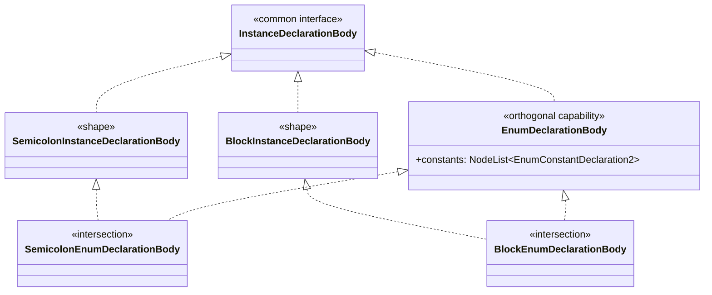
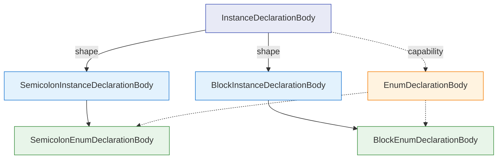

# Rethinking `GeneralizingAstVisitor`: Orthogonal AST Capabilities and Visitor Generalization

Reference: [Declaration, Top-Level, and Container AST Hierarchy Refactoring #64004](https://github.com/dart-lang/sdk/issues/64004)

## Summary

In the V2 AST refactoring ([#64004](https://github.com/dart-lang/sdk/issues/64004)), we introduce orthogonal capabilities and multi-faceted hierarchy models such as `InstanceDeclarationBody` (syntactic shape vs. enum payload) and `FragmentDeclaringNode` (semantic binding capability across expressions, members, and top-level declarations).

When defining `GeneralizingAstVisitor2` for this new hierarchy, we encounter a structural mismatch: **the current one-parent forwarding chain cannot represent every axis of a multi-dimensional type DAG.** It must select one privileged generalization path, even when the other interfaces are equally meaningful to clients.

`GeneralizingAstVisitor` predates language-level pattern matching. In modern Dart, `UnifyingAstVisitor2` combined with independent type patterns in `visitNode` can express overlapping structural and semantic capabilities directly, without asking the AST API to choose a canonical linearization.

This document proposes omitting the experimental `GeneralizingAstVisitor2` from the V2 AST API. V2 clients should instead use `UnifyingAstVisitor2` with pattern matching for polymorphic or capability-based processing, and `RecursiveAstVisitor2` for concrete-node traversal.

---

## 1. The Concrete Problem: The Orthogonal Axis Dilemma

In [#64004](https://github.com/dart-lang/sdk/issues/64004), instance declaration bodies are defined with two orthogonal dimensions:

The exact interface relationships are:



The same relationships can be viewed by axis. Solid edges represent the primary shape hierarchy, while dashed edges represent the orthogonal enum capability:



1. **Axis 1 (Syntactic Shape / Delimiters):** `BlockInstanceDeclarationBody` (`{ ... }`) vs. `SemicolonInstanceDeclarationBody` (`;`).
2. **Axis 2 (Semantic Capability / Payload):** `EnumDeclarationBody` (owns `constants: NodeList<EnumConstantDeclaration2>`).

### The Linear Visitor Deadlock

When a visitor visits `BlockEnumDeclarationBody`, what is the generalization step?

* **Option A: Follow Syntactic Shape (as proposed in #64004):**
  ```text
  BlockEnumDeclarationBody -> visitBlockInstanceDeclarationBody -> visitInstanceDeclarationBody -> visitNode
  ```
  * *Result:* Visitors checking delimiters, braces, and formatting work automatically.
  * *Failure:* Visitors interested in `EnumDeclarationBody` (e.g., enum lints, constant analyzers, element builders) **receive nothing**. `visitEnumDeclarationBody` does not even exist in the generalization chain. A consumer wanting all enum bodies must manually implement every concrete enum leaf method.

* **Option B: Follow Semantic Capability:**
  ```text
  BlockEnumDeclarationBody -> visitEnumDeclarationBody -> visitInstanceDeclarationBody -> visitNode
  ```
  * *Result:* Enum consumers work.
  * *Failure:* Syntactic consumers overriding `visitBlockInstanceDeclarationBody` **silently miss** `BlockEnumDeclarationBody`.

* **Option C: Invoke Both Generalizations:**
  If `visitBlockEnumDeclarationBody` calls *both* `visitBlockInstanceDeclarationBody` and `visitEnumDeclarationBody` under the current design, both branches eventually call `visitInstanceDeclarationBody` and `visitNode`. This duplicates callbacks and, because `visitNode` owns child traversal, can traverse the same subtree twice.

It is possible to design a more elaborate DAG-aware visitor by separating notification from traversal or by generating explicit deduplication. The current visitor contract does neither: each callback both represents a generalization step and forwards toward the single traversal in `visitNode`. Under that contract, [#64004](https://github.com/dart-lang/sdk/issues/64004) is forced to choose one path:

> *"There is no generalizing `visitEnumDeclarationBody` step. A consumer interested specifically in every enum body handles the two enum leaves, while a consumer interested in every block or semicolon body receives enum bodies through the common shape callback."*

This omission is not an isolated edge case. The same collision occurs with `FragmentDeclaringNode`:
* `FunctionExpression2` is both an `Expression` (grammar position) and a `FragmentDeclaringNode` (semantic capability).
* In `GeneralizingAstVisitor`, `FunctionExpression2` generalizes to `visitExpression`. The semantic axis (`visitFragmentDeclaringNode`) is completely discarded.

---

## 2. The Original Visitor Model

`GeneralizingAstVisitor` was introduced before Dart had pattern matching or type-based `switch`. A forwarding visitor hierarchy provided a concise way to handle broad categories such as all `Expression` or `Statement` nodes without listing every concrete subtype.

That remains useful when the AST has one primary classification tree. The V2 hierarchy changes the tradeoff: structural categories and semantic capabilities intentionally overlap, so a callback named for a public interface can no longer be assumed to receive every implementation of that interface.

---

## 3. Why `GeneralizingAstVisitor` Is Problematic in Modern Dart

1. **Arbitrary Hierarchy Projection:** It forces the AST designer to choose one privileged interface path. Other public capabilities do not receive a generalizing callback, even though the node implements them.
2. **Misleading API Expectations:** A method such as `visitEnumDeclarationBody` appears to mean "visit every enum declaration body." If some implementing leaves generalize through the shape axis instead, that expectation is false unless clients know the generator's chosen path.
3. **Coupled Notification and Traversal:** Every override must forward to `super.visitX(node)` or another more general method. Forgetting to forward suppresses both later generalization callbacks and child traversal. Other recursive visitors also require correct forwarding, but a generalizing chain creates more intermediate override points where it matters.
4. **Generated Forwarding Surface:** `GeneralizingAstVisitor2` needs methods for both concrete nodes and intermediate generalization categories. `UnifyingAstVisitor2` still needs one forwarding method per concrete `AstVisitor2` method, but does not need the additional hierarchy of intermediate forwarding methods.

The shorter `UnifyingAstVisitor2` call chain may also reduce virtual dispatch. This is not a basis for the API decision without benchmarks: pattern-based clients perform runtime type tests, and the relative cost depends on what each visitor checks.

---

## 4. The Alternative: `UnifyingAstVisitor` + Dart 3 Pattern Matching

With Dart 3, `UnifyingAstVisitor2` (where every concrete visit method directly calls `visitNode`) combined with independent patterns in `visitNode` provides an explicit solution for additive, multi-axis processing:

```text
class ContainerAndCapabilityVisitor extends UnifyingAstVisitor2<void> {
  @override
  void visitNode(AstNode node) {
    // 1. Generalize along Axis 1 (Syntactic Shape)
    if (node case BlockInstanceDeclarationBody body) {
      _checkBlockBraces(body.leftBracket, body.rightBracket);
    }

    // 2. Generalize independently along Axis 2 (Semantic Capability)
    if (node case EnumDeclarationBody body) {
      _processEnumConstants(body.constants);
    }

    // 3. Generalize across orthogonal semantic capabilities
    if (node case FragmentDeclaringNode decl) {
      _indexFragment(decl.declaredFragment);
    }

    // Single direct hop to children traversal
    super.visitNode(node);
  }
}
```

### Key Advantages

* **Full Orthogonality:** Consumers can inspect any interface or capability without being constrained by an arbitrary visitor linearization. The independent `if` statements above deliberately allow all applicable branches to run.
* **Explicit Semantics:** The client decides which overlapping categories matter and whether matches are additive or ordered.
* **Shallow Traversal:** A concrete visit method forwards directly to `visitNode`, which performs the checks and then visits children once.
* **Less Generated Generalization:** The generated visitor still implements every concrete `AstVisitor2` method, but no longer generates intermediate forwarding chains.
* **Pattern Destructuring:** Clients can inspect a node and bind the relevant fields in the same pattern (`case MethodDeclaration2(:var body)`).

### Return-Valued Visitors

The example above is a `void` visitor: all matching capabilities can contribute side effects before traversal continues. A visitor returning `R` needs an explicit result policy. If more than one pattern matches, the client must decide whether the first match wins, whether one axis is a fallback, or whether results are combined.

This is a real tradeoff. `GeneralizingAstVisitor2` currently provides reusable category fallbacks such as `visitExpression`, and subclasses can compose behavior through `super`. Under the proposed model, a return-valued client expresses that fallback with an ordered `switch`, a type test in `visitNode`, or a private helper. The absence of an implicit policy is intentional: there is no generally correct return-value composition for overlapping capabilities.

### Traversal Invariants

`UnifyingAstVisitor2` reduces the number of generalization methods through which traversal can be accidentally stopped, but does not eliminate the forwarding requirement. An override of `visitNode` must still call `super.visitNode(node)` when it wants recursive traversal. Similarly, a concrete override on `RecursiveAstVisitor2` must forward or visit children explicitly.

---

## 5. Proposal: Eliminate `GeneralizingAstVisitor2` from V2

1. **Do not generate or expose `GeneralizingAstVisitor2`:**
   Remove generation of `GeneralizingAstVisitor2` from `pkg/analyzer/tool/ast/generate.dart` and remove its generated declaration from `lib/dart/ast/visitor.g.dart`.
2. **Remove the unused V2 breadth-first visitor:**
   Remove the handwritten `BreadthFirstVisitor2` and `_BreadthFirstChildVisitor2` from `lib/dart/ast/visitor.dart`. There are no production or test clients of `BreadthFirstVisitor2` in the current SDK checkout. This does not affect the V1 `BreadthFirstVisitor`, which has existing test coverage.
3. **Leave legacy `GeneralizingAstVisitor` for V1 only:**
   Keep the existing `GeneralizingAstVisitor` (marked `@ToBeDeprecated`) strictly to support legacy V1 code during migration until V1 is deleted.
4. **Migrate existing analyzer clients:**
   At the time of writing, `pkg/analyzer` has nine subclasses of `GeneralizingAstVisitor2`. Migrate concrete-node visitors to `RecursiveAstVisitor2` or `UnifyingAstVisitor2`; migrate broad category overrides such as `visitExpression` and `visitStatement` to explicit patterns in `visitNode`; and replace return-valued category fallbacks with ordered patterns or private helpers.
5. **Establish canonical V2 traversal patterns:**
   * **Targeted/Concrete walks:** Use `RecursiveAstVisitor2` to intercept specific concrete AST nodes.
   * **Polymorphic/Capability/Multi-axis walks:** Use `UnifyingAstVisitor2` and inspect interfaces or patterns in `visitNode`.
   * **Non-recursive walks:** Use `SimpleAstVisitor2` or `ThrowingAstVisitor2`.
6. **Test the overlapping cases directly:**
   Verify that each enum body reaches both its shape and enum-capability handling exactly once, that `FunctionExpression2` reaches both expression and fragment-capability handling exactly once, and that children are traversed exactly once. Preserve focused tests for every migrated internal visitor.
